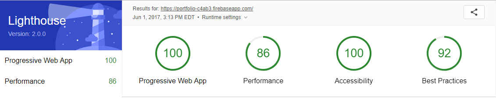

# Michael Gee's Personal Portfolio

## Progressive Web App

A front end project using HTML/CSS/JavaScript along with Polymer 2 elements and Firebase hosting to display full functional and fast progressive web app displaying my previous and current projects.

### Features include:

* Lightning fast load time (even on mobile - 1508.5ms average)
* Works completely offline after application is cached on first load.
* Fully responsive, works on all screen sizes
* Secure Network Connection - HTTPS
* Uses HTTP 2 to improve file load speed and efficiency
* Clean UI/UX
* Mobile-friendly design
* Splash screen on mobile devices

### Lighthouse (PWA) Report

### Run Application on your Local Machine:

    git clone https://github.com/michaelgee22/portfolio.git

Install the Dependencies

    bower install

Serve the application

    polymer serve

Application will be running on localhost:8081
